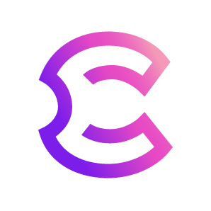

<div align="center">
  
  

  <h1>Cere <> School 42 Hackathon</h1>
</div>

<br><br><br>
# 🚀 **Quick Start Guide for Track 1: DDC Account Top-Up System**

## 📋 Table of Contents

1. [Introduction](#introduction)
2. [Quickstart Guide](#quickstart-guide)
   - [Setup](#setup)
   - [Key Resources](#key-resources)
   - [Implementation Steps](#implementation-steps)
3. [Milestones and Acceptance Criteria](#milestones-and-acceptance-criteria)
   - [MVP Milestones](#mvp-milestones)
   - [Nice-To-Have Features](#nice-to-have-features)
4. [Library Integration](#library-integration)
   - [Polkadot.js for Cere Testnet](#polkadotjs-for-cere-testnet)
   - [Ethers.js for Sepolia Testnet](#ethersjs-for-sepolia-testnet)
5. [CERE Token Faucet](#cere-token-faucet)
6. Submission Checklist

## 🌟 Introduction

Welcome to the Hackathon! This project aims to enhance the user experience for topping up DDC Accounts through a streamlined process that integrates Ethereum wallets with the Cere Mainnet. By leveraging the capabilities of Hyper Bridge and smart contracts, we will create an efficient and user-friendly top-up mechanism. This guide provides a comprehensive overview of the setup and implementation steps necessary to achieve this goal.

## 🏁 Quickstart Guide

### 🛠️ Setup

1. Clone the project repository.
2. Set up a React.js project.
3. Integrate Metamask using the [official documentation](https://docs.metamask.io/wallet/).

### 🔑 Key Resources

- CERE ERC Token Address (Sepolia): [0xf310641b4b6c032d0c88d72d712c020fca9805a3](https://sepolia.etherscan.io/token/0xf310641b4b6c032d0c88d72d712c020fca9805a3)
- TokenGateway Address (Sepolia): [0xFcDa26cA021d5535C3059547390E6cCd8De7acA6](https://sepolia.etherscan.io/address/0xFcDa26cA021d5535C3059547390E6cCd8De7acA6#writeContract)
- Cere Testnet Explorer: [https://explorer.cere.network/?rpc=wss%3A%2F%2Farchive.testnet.cere.network%2Fws#/explorer](https://explorer.cere.network/?rpc=wss%3A%2F%2Farchive.testnet.cere.network%2Fws#/explorer)

### 📝 Implementation Steps

1. **Connect to Metamask**: Implement wallet connection functionality in your React app.

2. **Initiate Token Transfer**: Use the `teleport` function in the TokenGateway contract to send tokens from Sepolia to Cere Testnet.

   ```javascript
   function teleport(
     address token,
     uint256 amount,
     uint32 destinationChainId,
     bytes32 recipient,
     bytes calldata data
   ) external payable returns (uint256 nonce);
   ```

   **Note**: In the `data` parameter, include the encoded call you want to execute on Cere Mainnet.

3. **Track Transaction**: Monitor the Cere Testnet for the corresponding event (approximately 20 minutes after initiating the transfer).

4. **Update UI**: Display transaction status and confirmation to the user.

## 🎯 Milestones and Acceptance Criteria

### 🏆 MVP Milestones

1. **Metamask Integration** 🦊
   - User can connect their Metamask wallet to the Developer Console.
   - The UI displays the connected wallet address and CERE token balance.

2. **Top-up Initiation** 💰
   - User can initiate a top-up transaction from the Developer Console.
   - The UI allows specifying the amount of CERE tokens to transfer.

3. **Transaction Execution** 🔄
   - The system interacts with the TokenGateway Contract (Hyperbridge) using Ethers.js.
   - The transaction is properly signed and sent to the Ethereum network.

4. **Transaction Monitoring** 👀
   - The UI displays transaction status (Pending, Completed, Failed).
   - User receives confirmation upon successful transaction completion.

5. **DDC Account Update** 📊
   - The system verifies transaction success on Cere Mainnet using Polkadot.js.
   - The user's DDC Account balance is updated accordingly.

6. **Error Handling** ⚠️
   - The system displays appropriate error messages for failed transactions.
   - Users receive clear instructions on resolving common issues.

### 🌈 Nice-To-Have Features

1. **Multi-Token Selection** 🔀
   - UI allows users to select from a list of supported ERC20 tokens for top-up.
   - Current exchange rate for selected token to CERE is displayed.

2. **Token Swap Integration** 💱
   - Successfully deploy and integrate a Token Swap Contract.
   - Users can approve token swap transactions from their Metamask wallet.

3. **Transaction History** 📜
   - The UI provides a history of both direct CERE top-ups and multi-token swaps.
   - Users can view details of past transactions, including original token, swap rate, and final CERE amount.

## 📚 Library Integration

### 🔗 Polkadot.js for Cere Testnet

Polkadot.js is the official JavaScript API for interacting with Polkadot SDK-based chains, including the Cere testnet.

#### Installation

```bash
npm install @polkadot/api
```

#### Usage

```javascript
import { ApiPromise, WsProvider } from '@polkadot/api';

async function connectToCere() {
  const wsProvider = new WsProvider('wss://archive.testnet.cere.network/ws');
  const api = await ApiPromise.create({ provider: wsProvider });
  console.log('Connected to Cere testnet:', api.genesisHash.toHex());
  return api;
}
```

#### Key Features

1. **Dynamic API Generation**: The API automatically generates interfaces based on the chain's metadata.
2. **Query Chain State**: Use `api.query` to read current chain state.
3. **Submit Transactions**: Use `api.tx` to submit extrinsics (transactions).
4. **Access Constants**: Use `api.consts` to access runtime constants.

### 🔗 Ethers.js for Sepolia Testnet

Ethers.js is a popular library for interacting with Ethereum-compatible networks, including the Sepolia testnet.

#### Installation

```bash
npm install ethers
```

#### Usage

```javascript
import { ethers } from 'ethers';

async function connectToSepolia() {
  const provider = new ethers.JsonRpcProvider('https://rpc.sepolia.org');
  const network = await provider.getNetwork();
  console.log('Connected to Sepolia testnet:', network.name);
  return provider;
}
```

#### Key Features

1. **Wallet Management**: Create and manage Ethereum wallets securely.
2. **Contract Interaction**: Easily interact with smart contracts using their ABI.
3. **Transaction Handling**: Send transactions and monitor their status.
4. **Event Listening**: Subscribe to and handle blockchain events.

## 🚰 CERE Token Faucet

To obtain test CERE tokens, fill out the provided form (link to be added).

Remember to refer to the official documentation and provided resources for contract ABIs and additional details.

## ✅ Submission Checklist

Before submitting your project, please ensure you've completed the following milestones and tasks:

### MVP Milestones

- [ ] Metamask Integration
   - [ ] Users can connect their Metamask wallet to the Developer Console
   - [ ] UI displays the connected wallet address and CERE token balance

- [ ] Top-up Initiation
   - [ ] Users can initiate a top-up transaction from the Developer Console
   - [ ] UI allows specifying the amount of CERE tokens to transfer

- [ ] Transaction Execution
   - [ ] System interacts with the TokenGateway Contract using Ethers.js
   - [ ] Transactions are properly signed and sent to the Ethereum network

- [ ] Transaction Monitoring
   - [ ] UI displays transaction status (Pending, Completed, Failed)
   - [ ] Users receive confirmation upon successful transaction completion

- [ ] DDC Account Update
   - [ ] System verifies transaction success on Cere Mainnet using Polkadot.js
   - [ ] User's DDC Account balance is updated accordingly

- [ ] Error Handling
   - [ ] System displays appropriate error messages for failed transactions
   - [ ] Users receive clear instructions on resolving common issues

### Nice-To-Have Features (Optional)

- [ ] Multi-Token Selection
- [ ] Token Swap Integration
- [ ] Transaction History

### Final Steps

- [ ] Code is well-documented and follows best practices
- [ ] README file is updated with project details and setup instructions
- [ ] All dependencies are listed in package.json
- [ ] Project is tested on both Sepolia and Cere testnets
- [ ] Code is pushed to a public GitHub repository

Once you've completed the checklist, please push your code to your GitHub repository and submit the link along with any additional documentation or demo videos.

Good luck with your submission! 🍀
